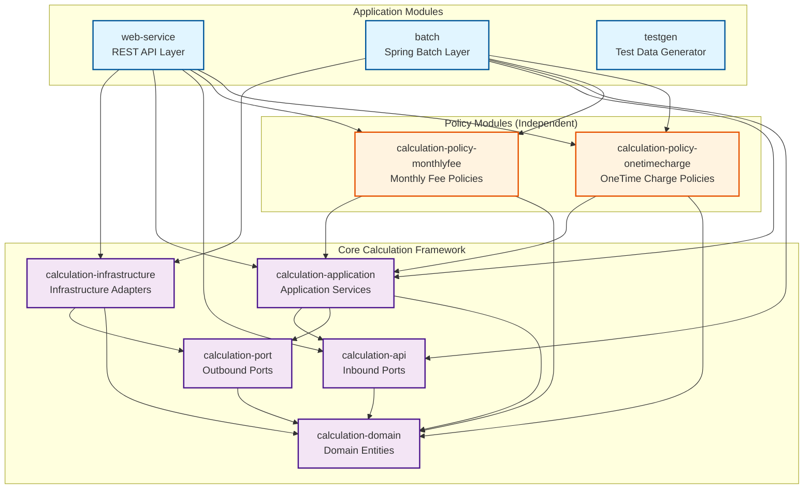
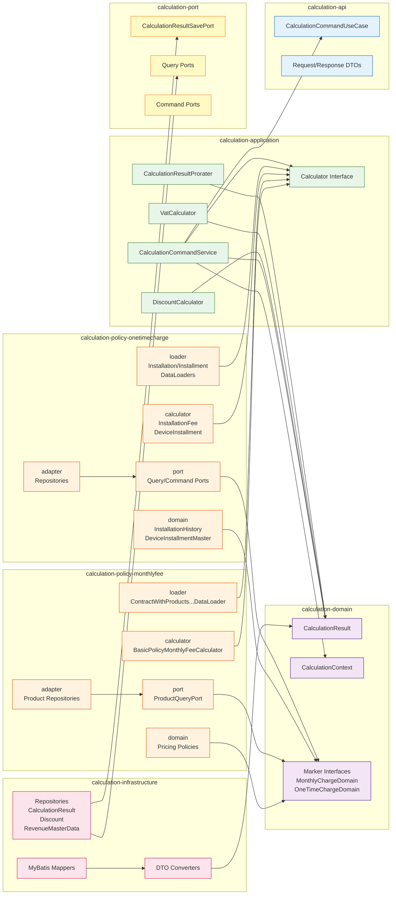
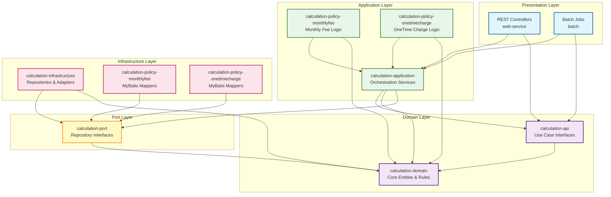

# Telecom Billing System - Module & Package Dependency

전체 시스템의 모듈 구조와 패키지 간 의존성 관계를 보여주는 다이어그램입니다.

## Module Architecture



## Package Structure & Dependencies



## Layer-based View



## Module Characteristics

### 📦 Core Calculation Framework (Under `calculation/`)

| Module | Type | Dependencies | Responsibility |
|--------|------|--------------|----------------|
| **calculation-domain** | Library JAR | None | Core domain entities, value objects, business rules |
| **calculation-api** | Library JAR | calculation-domain | Use case interfaces, request/response DTOs |
| **calculation-port** | Library JAR | calculation-domain | Repository interfaces (outbound ports) |
| **calculation-application** | Library JAR | api, port, domain | Application services, orchestration, calculators |
| **calculation-infrastructure** | Library JAR | port, domain, MyBatis | Repository implementations, adapters |

### 🎯 Policy Modules (Top-level, Independent)

| Module | Type | Dependencies | Responsibility |
|--------|------|--------------|----------------|
| **calculation-policy-monthlyfee** | Library JAR | application, domain | Monthly fee calculators, pricing policies, data loaders, MyBatis mappers |
| **calculation-policy-onetimecharge** | Library JAR | application, domain | OneTime charge calculators, data loaders, MyBatis mappers |

### 🚀 Application Modules

| Module | Type | Dependencies | Responsibility |
|--------|------|--------------|----------------|
| **web-service** | Boot JAR | All calculation + policy modules | REST API endpoints, Swagger, exception handling |
| **batch** | Boot JAR | All calculation + policy modules | Spring Batch processing, multi-threading |
| **testgen** | Boot JAR | MyBatis, MySQL | Test data generation with JavaFaker |

## Dependency Rules

### ✅ Allowed Dependencies
- Application modules → Core framework modules
- Application modules → Policy modules
- Policy modules → Application core (calculator interfaces)
- Policy modules → Domain (marker interfaces, entities)
- Infrastructure → Port interfaces
- All layers → Domain

### ❌ Forbidden Dependencies
- Domain → Infrastructure
- Domain → Application
- Core framework → Policy modules
- Policy modules → Application modules
- Lower layers → Higher layers

## Key Architectural Patterns

### 1. Hexagonal Architecture (Ports & Adapters)
- **Inbound Ports**: `calculation-api` (use case interfaces)
- **Outbound Ports**: `calculation-port` (repository interfaces)
- **Adapters**: `calculation-infrastructure`, policy module adapters

### 2. Dependency Inversion Principle
- Core domain has no dependencies
- Application depends on abstractions (ports)
- Infrastructure implements ports

### 3. Plugin Architecture
- Policy modules are independent plugins
- Auto-discovery via Spring `@Component` scanning
- Zero-code extensibility

### 4. Layer Isolation
- Clear separation between layers
- Dependencies flow inward (toward domain)
- Policy modules bridge application and domain

## Package Naming Convention

```
me.realimpact.telecom.calculation/
├── api/                                    # Use case interfaces
├── domain/                                 # Core domain entities
├── port/                                   # Repository interfaces
├── application/                            # Application services
├── infrastructure/                         # Infrastructure adapters
│   ├── adapter/
│   │   └── mybatis/
│   ├── dto/
│   └── converter/
└── policy/
    ├── monthlyfee/                        # Monthly fee policy
    │   ├── calculator/
    │   ├── loader/
    │   ├── domain/
    │   ├── adapter/
    │   │   └── mybatis/
    │   └── port/
    └── onetimecharge/                     # OneTime charge policy
        ├── calculator/
        ├── loader/
        ├── domain/
        ├── adapter/
        │   └── mybatis/
        └── port/
```

## 🎨 Design Benefits

### Separation of Concerns
- **Core Framework**: Provides calculation infrastructure
- **Policy Modules**: Implement specific business policies
- **Application Modules**: Consume framework + policies

### Independent Deployment
- Policy modules can be versioned independently
- Easy to add new policy modules
- Core framework updates don't affect policy implementations

### Testability
- Each module can be tested independently
- Policy modules have clear boundaries
- Mock-free domain testing

### Extensibility
- Add new calculators by implementing interfaces
- Spring auto-discovers `@Component` beans
- No modification to existing code required
